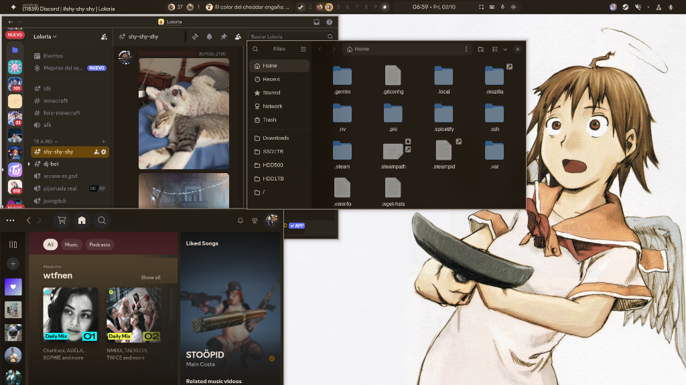
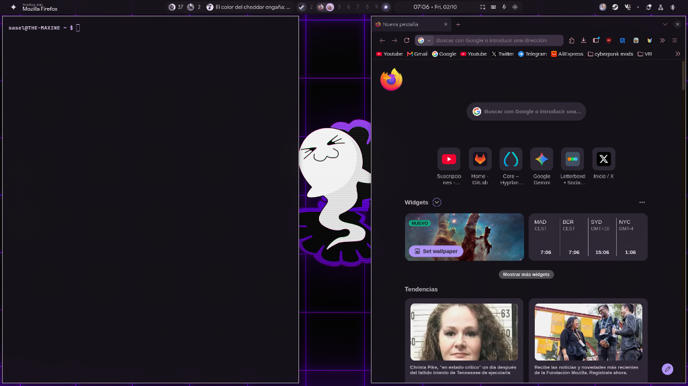
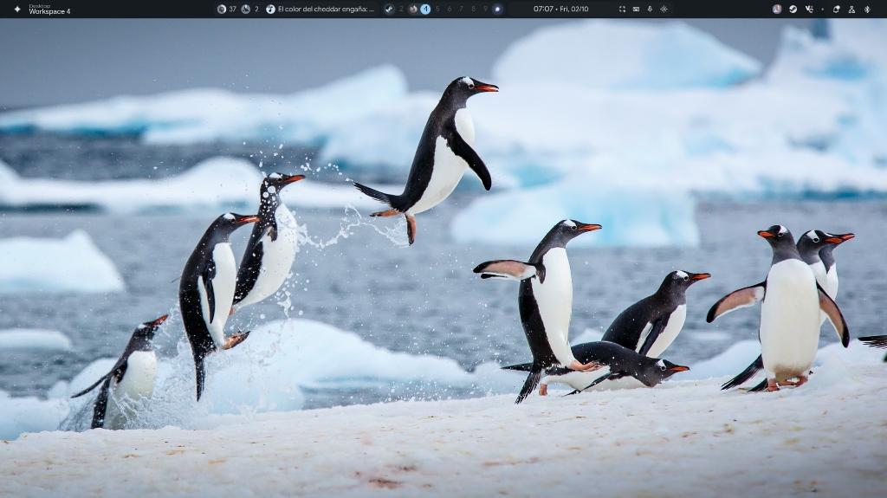
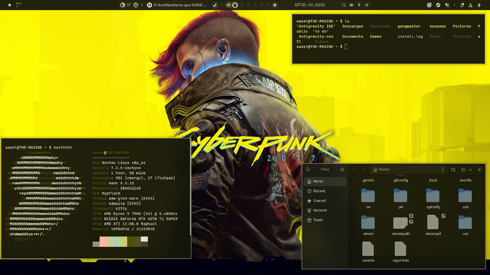

# 🎨 Better Window Manager (BWM) - Material You Desktop Environment

<div align="center">

**Un entorno de escritorio moderno, fluido y completamente reactivo para Wayland basado en Hyprland, Quickshell (Qt/QML) y tematización dinámica Material Design 3 (Material You).**

[](https://gitlab.com/saselandia/bwm)
[](https://github.com/saselandia/Better-Window-Manager)
[](https://opensource.org/licenses/MIT)
[](https://hyprland.org)
[](https://quickshell.outfoxxed.me)

</div>

---

## ✨ Características Principales

- 🎨 **Tematización Dinámica en Tiempo Real:** Cambia tu fondo de pantalla y todo el escritorio (ventanas, paneles, terminal y aplicaciones) adapta sus colores al instante.
- 📁 **Explorador Nautilus Integrado:** Abre tu gestor de archivos con **`Super + E`** o **`Alt + E`**, con modo oscuro y colores de acento sincronizados.
- 🚀 **Panel y Widgets Quickshell:** Barra superior con métricas de sistema, panel lateral de ajustes rápidos y selector de ventanas (**`Alt + Tab`**) con vista previa en directo.
- 🔍 **Menú de Aplicaciones:** Acceso rápido a tus apps y buscador integrado pulsando la tecla **`Super`**.
- 🌐 **Firefox, Vesktop y Spotify Tematizados:** Integración visual completa en tus aplicaciones diarias con colores dinámicos.
- 🪟 **Ventanas Flotantes Persistentes:** Recuerda qué aplicaciones prefieres en modo flotante o en mosaico entre sesiones con **`Alt + Q`**.
- 🖼️ **Selector de Fondos Visual:** Elige fondos de pantalla cómodamente con vista previa pulsando **`Alt + W`**.
- ⚡ **Instalador Rápido:** Configuración automatizada con un solo comando vía `install.sh`.

---

## 📸 Galería y Vistas Previas

> 💡 **Tematización Dinámica en Tiempo Real:** Al cambiar el fondo de pantalla, **todas las aplicaciones y widgets adaptan sus colores automáticamente** al esquema tonal generado por `matugen`.

| 🎨 Aplicaciones Tematizadas (Vesktop, Nautilus, Spotify) | 🌐 Firefox con userChrome.css y Terminal Kitty |
| :---: | :---: |
| [](assets/screenshots/01-apps-material-you.png) | [](assets/screenshots/02-firefox-terminal.png) |
| **❄️ Entorno Limpio con Barra y Widgets Quickshell** | **⚡ Tema Cyberpunk de Alto Contraste con Neofetch** |
| [](assets/screenshots/03-desktop-clean.jpg) | [](assets/screenshots/04-cyberpunk-neofetch.png) |

---

## 🛠️ Requisitos y Dependencias

Este entorno no incluye los binarios propietarios o pesados en el repositorio git para garantizar máxima ligereza y portabilidad entre distribuciones.

### Componentes Clave del Sistema:
| Paquete | Rol |
| :--- | :--- |
| **`hyprland`** | Compositor Wayland dinámico |
| **`quickshell`** | Framework de widgets y HUD de escritorio en QML |
| **`matugen`** | Generador de paletas Material You a partir de imágenes |
| **`swww`** | Demonio de fondos de pantalla de alto rendimiento con transiciones |
| **`swaync`** | Demonio y panel gráfico de notificaciones |
| **`rofi-wayland`** | Lanzador de aplicaciones y menú dinámico |
| **`kitty`** | Terminal acelerada por GPU |
| **`nautilus`** | Explorador de archivos (GNOME Files) con tema Material You dinámico |
| **`firefox`** | Navegador web principal con soporte de `userChrome.css` |
| **`flatpak`** | Gestor de aplicaciones Flatpak (necesario para Vesktop y Spotify) |
| **`playerctl`** | Integración y control multimedia MPRIS |
| **`wl-clipboard`** | Gestión de portapapeles (`wl-copy` / `wl-paste`) |
| **`jq` & `python3`** | Procesamiento de configuraciones y automatizaciones |

### Aplicaciones Flatpak Obligatorias:
| Aplicación | ID Flatpak | Rol |
| :--- | :--- | :--- |
| **Vesktop** | `dev.vencord.Vesktop` | Cliente de Discord con Vencord integrado y soporte de CSS |
| **Spotify** | `com.spotify.Client` | Reproductor oficial de música Spotify Desktop |

---

### Instalación de dependencias según tu distribución:

#### Arch Linux / CachyOS:
```bash
# Dependencias del sistema:
paru -S hyprland quickshell-git matugen-bin swww swaync rofi-wayland kitty playerctl wl-clipboard jq python nautilus firefox flatpak

# Flatpaks obligatorios:
flatpak install flathub dev.vencord.Vesktop com.spotify.Client
```

#### Gentoo Linux:
```bash
# Dependencias del sistema:
emerge --ask gui-wm/hyprland gui-apps/quickshell gui-apps/swww gui-apps/swaync gui-apps/rofi-wayland x11-terms/kitty media-sound/playerctl gui-apps/wl-clipboard app-misc/jq gnome-base/nautilus www-client/firefox sys-apps/flatpak

# Flatpaks obligatorios:
flatpak install flathub dev.vencord.Vesktop com.spotify.Client
```

#### Fedora:
```bash
# Dependencias del sistema:
sudo dnf install hyprland kitty playerctl wl-clipboard jq python3 nautilus firefox flatpak

# Flatpaks obligatorios:
flatpak install flathub dev.vencord.Vesktop com.spotify.Client
```

---

## 🚀 Descarga e Instalación

### 1. Clonar el repositorio

Puedes descargarlo desde GitHub o GitLab:

```bash
# Desde GitHub:
git clone https://github.com/saselandia/Better-Window-Manager.git ~/dotfiles/bwm
cd ~/dotfiles/bwm

# O desde GitLab:
git clone https://gitlab.com/saselandia/bwm.git ~/dotfiles/bwm
cd ~/dotfiles/bwm
```

### 2. Ejecutar el instalador

```bash
# Modo Enlace Simbólico (Recomendado para recibir actualizaciones continuas vía git pull):
./install.sh --symlink

# O Modo Copia Directa:
./install.sh --copy
```

*(Nota: En ambos modos, el instalador creará una copia de seguridad automática de cualquier configuración previa en `~/.config/`)*.

### 3. Iniciar o recargar el entorno

Si ya te encuentras dentro de una sesión de Hyprland:
```bash
hyprctl reload
```

Para aplicar tu fondo de pantalla favorito y generar la paleta de colores Material You:
```bash
# Pulsa [ALT + W] o ejecuta:
~/.config/hypr/scripts/set-wallpaper.sh /ruta/a/tu/imagen.jpg
```

---

## 🎨 Verificaciones Manuales de Aplicaciones

El instalador `./install.sh` se encarga de configurar y vincular los temas de todas las aplicaciones automáticamente. Si necesitas realizar alguna comprobación puntual o ajuste manual:

### 1. 📁 Nautilus (Explorador de Archivos)
- **Lanzador:** Pulsa **`Super + E`** o **`Alt + E`** en cualquier momento para abrir el gestor de archivos con el tema y acento activos.

### 2. 🌐 Firefox
- **Activar estilos de usuario:** Si no se aplican los colores tras abrir Firefox:
  1. Escribe `about:config` en la barra de direcciones.
  2. Asegúrate de que `toolkit.legacyUserProfileCustomizations.stylesheets` esté establecido en **`true`**.
  3. Reinicia Firefox.
- *(Opcional - Sincronización en vivo del Theme API)*: Para que la barra de pestañas cambie al vuelo sin recargar la ventana, instala la extensión [Pywalfox](https://addons.mozilla.org/firefox/addon/pywalfox/) y haz clic una vez en **"Fetch Pywal Colors"**.

### 3. 💬 Vesktop (Discord)
- **Verificación de tema:** En Vesktop, abre **Ajustes de usuario** → **Vencord** → **Temas** y confirma que **Material You** está habilitado.

### 4. 🎵 Spotify Desktop y Spicetify
- **Permisos de escritura para Flatpak:** Si Spicetify solicita permisos para inyectar el tema en el Flatpak de Spotify, ejecuta:
  ```bash
  chmod a+wr "$HOME/.local/share/flatpak/app/com.spotify.Client/x86_64/stable/active/files/extra/share/spotify" "$HOME/.local/share/flatpak/app/com.spotify.Client/x86_64/stable/active/files/extra/share/spotify/Apps" -R
  spicetify backup apply
  ```

---

## 🔄 Cómo Actualizar a la Última Versión

```bash
# 1. Entra a la carpeta del repositorio:
cd ~/dotfiles/bwm

# 2. Descarga la versión más reciente:
git pull

# 3. Si instalaste con enlaces simbólicos (--symlink), los cambios ya están activos.
#    Si instalaste con copia independiente (--copy), vuelve a copiar los cambios:
#    ./install.sh --copy

# 4. Recarga Hyprland para aplicar los cambios en caliente:
hyprctl reload
```

---

## ⌨️ Atajos de Teclado Principales

> Nota: En esta configuración, las teclas modificadoras principales son **`ALT`** y **`SUPER`**.

| Atajo | Acción |
| :--- | :--- |
| **`SUPER_L`** (Win) | Abrir Menú de Aplicaciones / Búsqueda en Quickshell |
| **`SUPER + E`** / **`ALT + E`** | **Lanzador: Explorador de archivos (Nautilus)** |
| **`CTRL + ENTER`** | Abrir terminal Kitty con tema dinámico |
| **`ALT + TAB`** | Selector visual de ventanas con vista previa en tiempo real |
| **`ALT + W`** | Selector gráfico de fondos de pantalla con autotematización |
| **`ALT + Q`** | Alternar y recordar regla flotante persistente para la ventana activa |
| **`ALT + X`** | Cerrar ventana activa |
| **`ALT + 1` .. `ALT + 0`** | Cambiar a los espacios de trabajo (1 al 10) |
| **`ALT + SHIFT + [1-0]`** | Mover ventana activa al espacio de trabajo correspondiente |
| **`SUPER + A`** | Abrir / Cerrar panel lateral de ajustes rápidos |
| **`SUPER + L`** | Bloquear pantalla con Quickshell Lock |
| **`SUPER + SHIFT + S`** / **`Print`** | Captura de pantalla por región |
| **`ALT + A`** | Mostrar guía interactiva de atajos en pantalla (Cheatsheet) |

---

## 💖 Créditos y Agradecimientos

Este proyecto se inspira y construye sobre el excelente trabajo de la comunidad:

- **[end-4 / dots-hyprland](https://github.com/end-4/dots-hyprland)**: Base fundamental e inspiración para los widgets de Quickshell (Illogical Impulse), animaciones y sistema de temas Material You.
- **[Hyprland](https://hyprland.org)**: Compositor Wayland fluido, dinámico y extensible.
- **[Quickshell](https://quickshell.outfoxxed.me)**: Framework flexible para widgets y barras de escritorio en Qt/QML.
- **[Matugen](https://github.com/InioX/matugen)**: Generador dinámico de paletas de color Material Design 3.

---

## 🤝 Contribuciones y Desarrollo

Si deseas proponer mejoras, corregir errores o colaborar:

1. Haz un **Fork** del proyecto en GitHub o GitLab.
2. Crea una rama para tu función (`git checkout -b feature/nueva-mejora`).
3. Realiza tus cambios y haz commit (`git commit -m "feat: añadir soporte para..."`).
4. Sube tu rama (`git push origin feature/nueva-mejora`) y abre un **Pull Request** / **Merge Request**.
